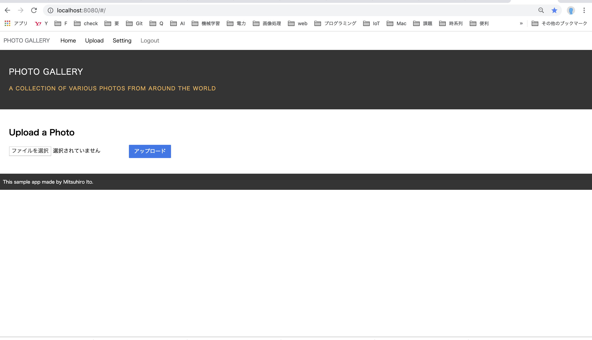

# serverless-spa

## 「Amazon Web Servicesを使ったサーバーレスアプリケーション開発ガイド」の内容です  
https://www.amazon.co.jp/Amazon-Web-Services%E3%82%92%E4%BD%BF%E3%81%A3%E3%81%9F%E3%82%B5%E3%83%BC%E3%83%90%E3%83%BC%E3%83%AC%E3%82%B9%E3%82%A2%E3%83%97%E3%83%AA%E3%82%B1%E3%83%BC%E3%82%B7%E3%83%A7%E3%83%B3%E9%96%8B%E7%99%BA%E3%82%AC%E3%82%A4%E3%83%89-%E8%A5%BF%E8%B0%B7-%E5%9C%AD%E4%BB%8B/dp/4839964564/ref=sr_1_3?s=books&ie=UTF8&qid=1552821142&sr=1-3&keywords=serverless




## Build Setup

``` bash
# install dependencies
npm install

# serve with hot reload at localhost:8080
npm run dev

# build for production with minification
npm run build

# build for production and view the bundle analyzer report
npm run build --report

# run unit tests
npm run unit

# run e2e tests
npm run e2e

# run all tests
npm test
```

For a detailed explanation on how things work, check out the [guide](http://vuejs-templates.github.io/webpack/) and [docs for vue-loader](http://vuejs.github.io/vue-loader).
